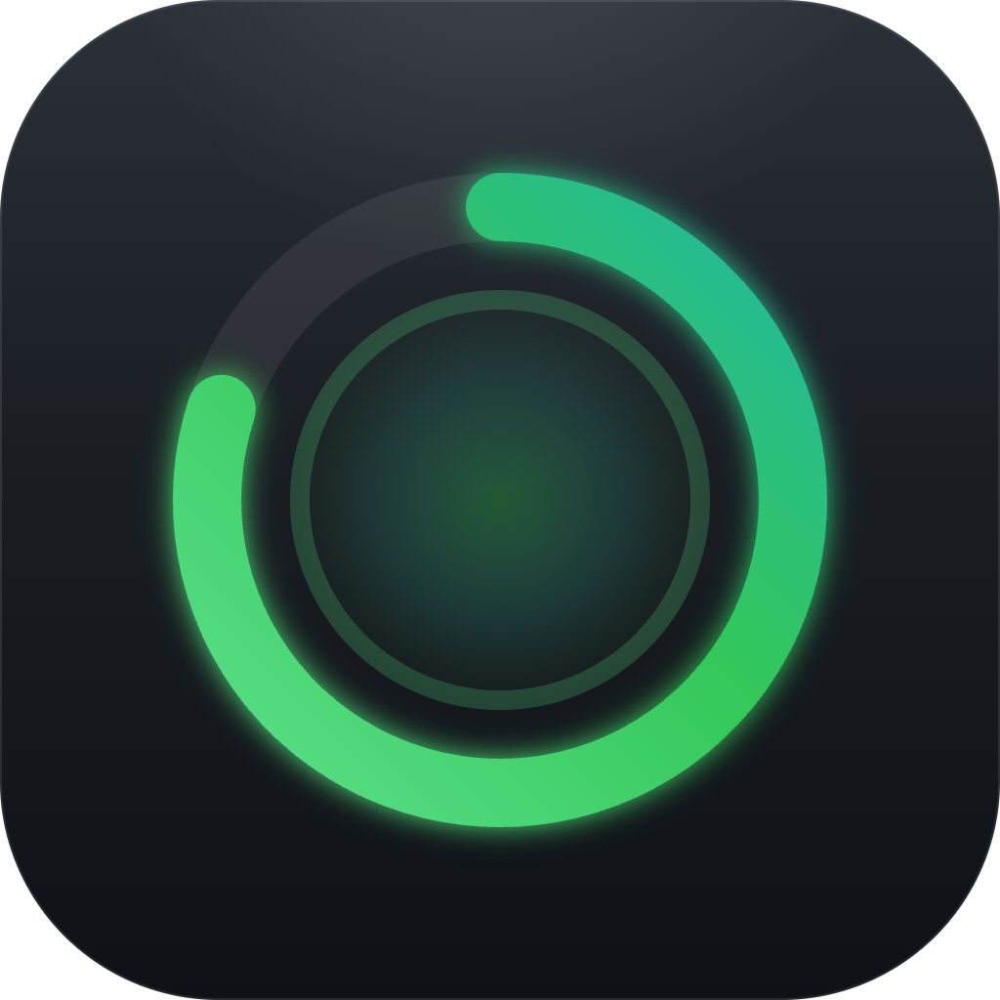

<p align="center">
  
</p>

<h1 align="center">Halo Usage</h1>

Claude Code and Codex usage in your macOS menu bar. Open Halo for a readable
overview of plan limits and local activity, with notifications before a limit
is exhausted.

<p align="center">
  
</p>

The menu bar defaults to the most-used limit. Open Halo to see every limit in
its own row, with the full name, percentage used, remaining capacity, and reset
time. Progress turns orange at 70% and red at 90%; limits near exhaustion also
have a text warning. The dashboard follows macOS light and dark appearance.

> **Unofficial client.** Halo is not affiliated with or endorsed by Anthropic
> or OpenAI. Codex integration uses the documented local app-server protocol;
> Claude's account endpoint is not a documented public API and may change.

## Install

### Download

Download the latest release, open the `.dmg`, and drag **Halo Usage** into
Applications. The universal app requires macOS 13 Ventura or later.

### Build from source

```bash
git clone https://github.com/mathibesil-apps/halo-for-claude.git
cd halo-for-claude
./build.sh
cp -r "Halo Usage.app" /Applications
open "/Applications/Halo Usage.app"
```

## Choose Claude or Codex

Use the **Claude / Codex** selector at the top of the dashboard to switch at any
time. The selected service is remembered between launches. **Overview** shows
plan limits and local totals; **Activity** contains hourly usage, token and model
breakdowns, active sessions, and account history. The gear button opens settings
and help; right-clicking the menu bar item opens the same menu.

### Codex

Halo starts the installed `codex app-server` over its documented local stdio
protocol and calls:

- `account/rateLimits/read` for every account-wide and model-specific limit;
- `account/usage/read` for lifetime and daily account activity.

Codex owns and refreshes the ChatGPT login. Halo never reads
`~/.codex/auth.json`, never handles the access token, and does not require an
additional sign-in. The app looks for the Codex binary bundled with ChatGPT and
in common CLI locations. Set `CODEX_CLI_PATH` when using a custom installation.

Detailed project/model statistics come from local rollout logs in
`~/.codex/sessions` and `~/.codex/archived_sessions`. Codex cached input is a
subset of input tokens, so Halo displays it separately without counting it
twice. When local sessions come from more than one account source, Halo adds
numbered account tabs that separately filter totals, charts, models, and active
sessions. It uses only each rollout's `session_meta.model_provider`; provider
names are not displayed, and account identifiers and credentials are never
read. Plan-limit rings and account summaries are labeled separately because
they belong to the current ChatGPT login used by the installed Codex process.

### Claude Code

Halo keeps the original three limit sources:

- **Automatic** — official status-line data when configured, otherwise live
  account limits, otherwise a local estimate.
- **Local — no token, no network** — official status-line data or an estimate
  from `~/.claude/projects`.
- **Anthropic account (token)** — exact account limits fetched with the Claude
  login stored in the macOS Keychain.

If there is no usable Claude Code login, **Connect to Claude…** starts the OAuth
flow and stores Halo's own grant in its Keychain item. Disconnecting never
removes Claude Code's login.

Claude account tabs use an in-memory SHA-256 digest of the `accountUuid` already
present in local session logs. The original identifier is never displayed,
stored by Halo, or included in diagnostics.

## What you get

- Full-width limit bars with readable percentages, remaining capacity, and reset times.
- Dynamic model limits and model breakdowns.
- Current five-hour activity, burn rate, input/output/cache totals.
- Today and last-seven-days local totals by project and model.
- Numbered account-source tabs for local Claude and Codex activity, including separate model totals.
- Codex account lifetime, peak-day, streak, and longest-turn summaries.
- Notifications at 80% and 95%, projected exhaustion, unused capacity before a
  reset, and completed resets.
- Automatic insights for large contexts, usage spikes, and projected limits.

Codex plan usage is shown as tokens and authoritative limit percentages rather
than an estimated dollar amount. Claude retains the approximate list-API cost
display; subscription users do not pay that amount.

## Diagnostics

To test the Codex connection without opening the menu-bar UI:

```bash
"/Applications/Halo Usage.app/Contents/MacOS/Halo" --codex-probe
```

The diagnostic prints only limit labels/percentages and aggregate token counts;
it does not print credentials, account identifiers, prompts, or project names.

## Notes

- Limits are refreshed every two minutes; local logs refresh every minute.
- JSONL files are cached by modification time and size, so unchanged sessions
  are not reparsed.
- **Worst limit only** is the compact menu bar default. Choose **All limits** in
  settings to show every ring there; the dashboard always includes every limit.
- Refresh is available at the bottom of the dashboard or with **⌘R**. Its icon
  spins while updating and briefly confirms completion; unavailable, estimated,
  and saved limits are labeled.
- Demo mode anonymizes project names:
  `defaults write com.mathiasbesil.halo demoMode -bool true`.

### UI preview

Run the built app with synthetic data, without reading logs, contacting accounts,
or changing saved preferences:

```bash
"Halo Usage.app/Contents/MacOS/Halo" --ui-preview --light
```

Use `--dark`, `--activity`, `--empty`, `--stale`, `--estimated`, or `--stress`
to review appearance, unavailable data, saved limits, and long labels. Both
service tabs work in preview mode.

## License

MIT — see [LICENSE](LICENSE).
