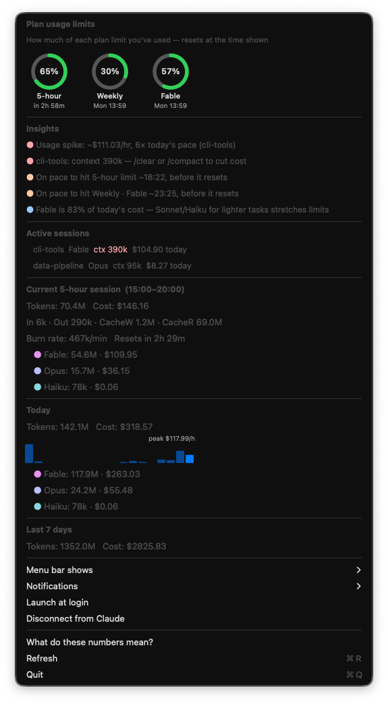

<p align="center">
  
</p>

<h1 align="center">Halo for Claude</h1>

Claude Code usage in your macOS menu bar — how much of each plan limit you've
burned, at a glance, with a nudge before you hit one.

<p align="center">
  
</p>

One ring per plan limit, filling clockwise, green → orange at 70% → red at 90%.
Click it for reset times, what's driving your spend, and what to do about it.

<p align="center">
  
</p>

<sub>Project names in this screenshot are anonymized (demo mode) — your real
ones appear in the app.</sub>

> **Unofficial.** Not affiliated with or endorsed by Anthropic. It reads a
> usage endpoint that isn't a documented public API, so it may break without
> warning.

<p align="center">
  <a href="https://buymeacoffee.com/mathias.besil"></a>
</p>

## Install

### Download (easiest)

**[⬇ Download the latest .dmg](https://github.com/mathibesil-apps/halo-for-claude/releases/latest)**,
open it, and drag **Halo for Claude** into Applications. It's signed and
notarized by Apple, so it opens with a double-click — no security warnings.

Then, in the menu: **Launch at login**.

### Build from source

Requires macOS and the Xcode Command Line Tools (`xcode-select --install`).

```bash
git clone https://github.com/mathibesil-apps/halo-for-claude.git
cd halo-for-claude
./build.sh
cp -r "Halo for Claude.app" /Applications
open "/Applications/Halo for Claude.app"
```

## Sign-in (usually none)

Halo first tries the login Claude Code already keeps in your macOS Keychain —
macOS asks your permission once (**Always Allow**) and, for most installs, the
rings just appear. That path is strictly read-only: Halo never writes to Claude
Code's Keychain item, and if the stored token has aged it renews it in memory
the same way Claude Code itself does on each run.

If your machine has no usable stored login (some setups keep it elsewhere),
the menu offers **Connect to Claude…** — a standard OAuth flow in your
browser; paste the code back and Halo keeps its own connection in its own
Keychain item from then on. **Disconnect from Claude** removes it.

Either way it never asks for a password and never talks to anything except
Anthropic. Not connected at all? Everything below the rings still works —
token and cost stats come from your local logs.

## Where the plan limits come from

Halo resolves the ring percentages from the best source available, and labels
which one it used:

1. **Official (recommended)** — Claude Code itself can hand Halo its real 5-hour
   and weekly limits, locally, with **no network call and no token**. Turn it on
   from the menu: **Use Claude Code's official limits** (it adds a `statusLine`
   entry to `~/.claude/settings.json`, with your consent and a backup). This is
   the most reliable source and doesn't touch any Anthropic endpoint.
2. **Live** — the account usage endpoint (accurate, but an undocumented API that
   can change).
3. **Estimated** — if neither is available, Halo estimates your 5-hour usage from
   local logs against a self-calibrating cap, so the ring keeps working. The menu
   marks these as *estimated*.

## What you get

**Plan limits** — a ring per limit (5-hour session, weekly across all models,
and per-model weekly ones), each with its reset time. These are your account's
real numbers, the same ones claude.ai's usage page shows.

**Notifications** — four kinds, each switchable on its own, each firing at most
once per limit per window:

| | |
|---|---|
| Approaching a limit | passing 80%, then 95% |
| On pace to hit a limit | your current pace would exhaust it before it resets |
| Unused capacity before a reset | 30 min before a 5-hour window resets (1 hour for weekly) while ≥25% is still unused — spend it or lose it |
| A spent limit has reset | one you nearly used up rolled over |

**Insights** — shown only when there's something to act on:
- usage spike: last 15 minutes vs today's pace, and the project driving it
- oversized session context (>120k tokens): suggests `/clear` or `/compact`,
  since the whole context is re-sent — and re-billed — every message
- on pace to hit a limit before it resets
- model mix: when one expensive model dominates today's cost

**Stats from your local logs** (`~/.claude/projects`) — active sessions with
their context sizes, the current 5-hour block with burn rate and token
breakdown, today's totals with an hourly spend chart, and last 7 days.

New to the numbers? The menu has a **"What do these numbers mean?"** explainer.

## Notes

- **Cost is an estimate** from list API pricing. On a Pro/Max subscription you
  don't pay it — it's a sense of scale, and of what each limit window buys you.
- Limits are polled every 2 minutes (backing off if the endpoint rate-limits);
  local stats refresh every 60 seconds. Log files are parsed once and cached by
  (mtime, size), so only changed files get re-read.
- The 5-hour block boundary uses the same algorithm as ccusage: the block starts
  at the first message's timestamp floored to the hour and lasts 5 hours.
- `build.sh` signs with a Developer ID or Apple Development certificate if your
  machine has one, otherwise ad-hoc. Ad-hoc signatures change on every build, so
  macOS re-asks for Keychain access each time you rebuild — harmless, just
  click Always Allow. Override with `CODESIGN_ID="..." ./build.sh`.
- **Demo mode** (for docs screenshots) anonymizes project names:
  `defaults write com.mathiasbesil.halo demoMode -bool true`, relaunch, capture,
  then `-bool false` and relaunch to restore your real names.

## Releasing (maintainer)

`./release.sh` builds, signs with a Developer ID + hardened runtime, packages a
drag-to-Applications `.dmg`, notarizes it with Apple, and staples the ticket.

One-time setup: create an app-specific password at
[appleid.apple.com](https://appleid.apple.com), then store notary credentials
once:

```bash
xcrun notarytool store-credentials "halo-notary" \
    --apple-id "you@example.com" --team-id "YOURTEAMID"
```

Then `./release.sh` produces `Halo-for-Claude.dmg`, which is uploaded as a
GitHub Release asset (the `.dmg` itself is git-ignored).

## Support

Halo is free and open-source. If it saves you from blowing a limit, you can
[buy me a coffee](https://buymeacoffee.com/mathias.besil) ☕ — entirely optional,
always appreciated.

## License

MIT — see [LICENSE](LICENSE).
